# オープンMESプロジェクトのクラス構造

以下に、open-mes-projectのバックエンド（`backend/src/`）で定義されている主要なDjangoモデルのクラス図と各クラスの説明を示します。パッケージ（Djangoアプリ）ごとにクラスを整理してあり、継承関係は実線の三角矢印、関連（アソシエーション）は実線でカーディナリティ（多重度）付きの線で表現しています。

## クラス図

```mermaid
classDiagram
%% Users module
class CustomUser {
    +id: UUID
    +custom_id: string
    +username: string
    +email: string
    +is_staff: bool
    +is_active: bool
    +date_joined: datetime
    +password_last_changed: datetime
    +account_type: string
    +objects: UserManager
    +is_password_expired: bool
}
class UserManager {
    +create_user(...)
    +create_superuser(...)
}
class ApiTokenPolicy {
    +id: int
    +is_active: bool
    +allowed_ips: text
    +scopes: json
    +created_at: datetime
    +updated_at: datetime
}
CustomUser --|> AbstractBaseUser
CustomUser --|> PermissionsMixin
CustomUser "1" -- "0..1" ApiTokenPolicy : api_token_policy

%% Master module
class Item {
    +name: string
    +code: string
    +item_type: string
    +unit: string
    +description: text
    +default_warehouse: string
    +default_location: string
    +provision_type: string
    +created_at: datetime
}
class Supplier {
    +supplier_number: string
    +name: string
    +contact_person: string
    +phone: string
    +email: string
    +address: text
    +created_at: datetime
}
class Warehouse {
    +id: UUID
    +warehouse_number: string
    +name: string
    +location: string
    +layout_cols: int
    +layout_rows: int
}
class WarehouseLocation {
    +id: UUID
    +code: string
    +name: string
    +pos_x: int
    +pos_y: int
    +width: int
    +height: int
    +created_at: datetime
}
class Customer {
    +id: UUID
    +code: string
    +name: string
    +created_at: datetime
}
class WorkCenter {
    +id: UUID
    +code: string
    +name: string
    +created_at: datetime
}
class UnitCost {
    +id: UUID
    +cost: decimal
    +created_at: datetime
    +updated_at: datetime
}
class BillOfMaterial {
    +id: UUID
    +quantity: decimal
    +remarks: text
    +created_at: datetime
    +updated_at: datetime
}

%% Inventory module
class Inventory {
    +id: UUID
    +quantity: int
    +reserved: int
    +location: string
    +first_received_at: datetime
    +last_updated: datetime
    +is_active: bool
    +is_allocatable: bool
    +available_quantity(): int
}
class StockMovement {
    +id: UUID
    +location: string
    +movement_type: string
    +quantity: int
    +movement_date: datetime
    +description: text
    +reference_document: string
}
class PurchaseOrder {
    +id: UUID
    +order_number: string
    +quantity: int
    +received_quantity: int
    +order_date: datetime
    +expected_arrival: datetime
    +status: string
    +remaining_quantity(): int
}
class Receipt {
    +id: UUID
    +received_quantity: int
    +received_date: datetime
    +location: string
    +remarks: text
}
class SalesOrder {
    +id: UUID
    +order_number: string
    +quantity: int
    +shipped_quantity: int
    +order_date: datetime
    +expected_shipment: datetime
    +status: string
    +remaining_quantity(): int
}

%% Production module
class ProductionPlan {
    +id: UUID
    +plan_name: string
    +planned_quantity: int
    +planned_start_datetime: datetime
    +planned_end_datetime: datetime
    +actual_start_datetime: datetime
    +actual_end_datetime: datetime
    +status: string
    +remarks: text
    +created_at: datetime
    +updated_at: datetime
}
class PartsUsed {
    +id: UUID
    +production_plan: string
    +quantity_used: int
    +used_datetime: datetime
    +remarks: text
    +created_at: datetime
    +updated_at: datetime
}
class MaterialAllocation {
    +id: UUID
    +allocated_quantity: int
    +allocation_datetime: datetime
    +status: string
    +remarks: text
    +created_at: datetime
    +updated_at: datetime
}
class WorkProgress {
    +id: UUID
    +process_step: string
    +start_datetime: datetime
    +end_datetime: datetime
    +quantity_completed: int
    +actual_reported_quantity: int
    +defective_reported_quantity: int
    +status: string
    +remarks: text
    +created_at: datetime
    +updated_at: datetime
}

%% Quality module
class InspectionItem {
    +id: UUID
    +code: string
    +name: string
    +inspection_type: string
    +target_object_type: string
    +is_active: bool
}
class MeasurementDetail {
    +id: UUID
    +name: string
    +measurement_type: string
    +specification_nominal: float
    +specification_upper_limit: float
    +specification_lower_limit: float
    +expected_qualitative_result: string
    +order: int
}
class InspectionResult {
    +id: UUID
    +inspected_at: datetime
    +part_number: string
    +lot_number: string
    +serial_number: string
    +quantity_inspected: int
    +judgment: string
    +remarks: text
}
class InspectionResultDetail {
    +id: UUID
    +measured_value_numeric: float
    +result_qualitative: string
}

%% Machine module
class Machine {
    +id: UUID
    +machine_number: string
    +name: string
    +location: string
    +description: text
    +created_at: datetime
}

%% Base module
class BaseSetting {
    +id: UUID
    +name: string
    +value: text
    +is_active: bool
}
class AsyncTask {
    +id: UUID
    +task_id: string
    +task_name: string
    +status: string
    +progress: int
    +total: int
    +result: json
}

%% Relationships (associations)
Item "1" -- "0..*" Inventory : part_number_rel
Warehouse "1" -- "0..*" Inventory : warehouse_rel
Item "1" -- "0..*" StockMovement : part_number_rel
Warehouse "1" -- "0..*" StockMovement : warehouse_rel
CustomUser "1" -- "0..*" StockMovement : operator
Supplier "1" -- "0..*" PurchaseOrder : supplier_rel
Item "1" -- "0..*" PurchaseOrder : part_number_rel
Warehouse "1" -- "0..*" PurchaseOrder : warehouse_rel
PurchaseOrder "1" -- "0..*" Receipt : purchase_order
Warehouse "1" -- "0..*" Receipt : warehouse_rel
CustomUser "1" -- "0..*" Receipt : operator
Item "1" -- "0..*" SalesOrder : item_rel
Warehouse "1" -- "0..*" SalesOrder : warehouse_rel
Warehouse "1" -- "0..*" WarehouseLocation : warehouse
Item "1" -- "0..*" UnitCost : item
Item "1" -- "0..*" BillOfMaterial : product_rel
Item "1" -- "0..*" BillOfMaterial : material_rel
Item "1" -- "0..*" ProductionPlan : product
Item "1" -- "0..*" MaterialAllocation : material
Warehouse "1" -- "0..*" MaterialAllocation : warehouse_rel
ProductionPlan "1" -- "0..*" MaterialAllocation : production_plan
ProductionPlan "1" -- "0..*" WorkProgress : production_plan
CustomUser "1" -- "0..*" WorkProgress : operator
Item "1" -- "0..*" PartsUsed : part
Warehouse "1" -- "0..*" PartsUsed : warehouse_rel
InspectionItem "1" -- "0..*" MeasurementDetail : inspection_item
InspectionItem "1" -- "0..*" InspectionResult : inspection_item
CustomUser "1" -- "0..*" InspectionResult : inspected_by
InspectionResult "1" -- "0..*" InspectionResultDetail : inspection_result
MeasurementDetail "1" -- "0..*" InspectionResultDetail : measurement_detail
```

上記クラス図に基づき、各クラスの役割と主要な関係について以下に説明します。

## Users（ユーザー）モジュール

**CustomUser** – Django組み込みの認証用`AbstractBaseUser`および`PermissionsMixin`を継承したカスタムユーザークラスです。主キーはUUID（`uuid.uuid4`）です。ログインには`custom_id`（専用ID、ユニーク）を用いるよう設計されており（`USERNAME_FIELD = "custom_id"`）、`email`は必須項目ではありません。`is_staff`や`is_active`でユーザーの権限状態を管理し、`password_last_changed`と`is_password_expired`プロパティによりパスワード有効期限（デフォルト180日、`settings.PASSWORD_EXPIRATION_DAYS`）を管理します。`objects`にカスタムマネージャ`UserManager`を割り当てており、`create_user()`・`create_superuser()`メソッドでユーザー作成処理を提供します。また、`account_type`フィールド（`human`＝通常ユーザー／`system`＝外部システム連携用、デフォルト`human`）により、人が使うアカウントか外部連携専用アカウントかを区別します。

**ApiTokenPolicy** – 外部連携用アカウントのAPIトークンに対するアクセス制御を管理するクラスです。`CustomUser`への1対1FK（`related_name="api_token_policy"`）を持ち、`is_active`（トークン有効フラグ）、`allowed_ips`（接続許可IP、CIDR/カンマ・改行区切り）、`scopes`（アクセス可能なAPIアプリ名のJSON配列、空リストの場合は全アプリ許可）を保持します。認証には`users/authentication.py`で定義された`ScopedTokenAuthentication`（DRFの`TokenAuthentication`のサブクラス）が用いられ、`ApiTokenPolicy`が設定されているユーザーについてはトークン有効フラグ・接続元IP・アクセス可能スコープを検証します（ポリシー未設定ユーザーは後方互換のため無制限にアクセス可能です）。

## Master（マスターデータ）モジュール

**Item（品目）** – 製品や原材料を表すマスターデータのクラスです。`name`（名称）・`code`（コード）はユニーク制約付きです。`item_type`フィールドで「product（製品）」か「material（材料）」かを区別します。`unit`（単位、デフォルト`kg`）、`description`（説明）に加え、`default_warehouse`/`default_location`（デフォルトの入庫先倉庫・棚番）、`provision_type`（有償支給/無償支給/支給なし）を持ちます。Itemは`Inventory`、`StockMovement`、`PurchaseOrder`、`SalesOrder`、`ProductionPlan`、`PartsUsed`、`MaterialAllocation`、`UnitCost`、`BillOfMaterial`（製品・使用部品の双方として2回参照）など、他の多くのクラスから外部キー（`to_field="code"`で品目コードを参照）で参照される中心的存在です。

**Supplier（サプライヤー）** – サプライヤー（部品・材料の供給元）を表すマスタークラスです。`supplier_number`（サプライヤー番号）がユニークキーで、`name`（名前）、`contact_person`（担当者）、`phone`、`email`、`address`といった連絡先情報を持ちます。`PurchaseOrder`から参照されます。

**Warehouse（倉庫）** – 製品や材料の保管場所を表すマスタークラスです。主キーはUUIDv7（`uuid7`）。`warehouse_number`（倉庫番号）と`name`で倉庫を識別し、`location`（所在地）に加え、倉庫レイアウトマップの列数・行数を表す`layout_cols`/`layout_rows`を持ちます。`Inventory`、`StockMovement`、`PurchaseOrder`、`Receipt`、`SalesOrder`、`MaterialAllocation`、`PartsUsed`、`WarehouseLocation`から参照されます。

**WarehouseLocation（倉庫ロケーション）** – 倉庫レイアウト上の棚配置を表すクラスです。`Warehouse`へのFK（`related_name="locations"`）を持ち、`code`（棚番、`Inventory.location`の文字列と対応させる）、`name`、レイアウトマップ上の座標（`pos_x`, `pos_y`）とサイズ（`width`, `height`）を保持します。`warehouse`と`code`の組み合わせでユニーク制約があります。

**Customer（顧客）** – 顧客マスターです。UUIDv7主キー、`code`（顧客コード、ユニーク）、`name`を持ちます。

**WorkCenter（ワークセンター）** – 生産の作業区・工程拠点を表すマスターです。UUIDv7主キー、`code`（ユニーク）、`name`を持ちます。

**UnitCost（標準単価）** – `Item`に対する標準単価を保持するクラスです。`item`への1対1相当のFK（ユニーク制約あり）と`cost`（数値、小数2桁）を持ちます。

**BillOfMaterial（使用部品構成／BOM）** – 製品ごとの使用部品構成（部品表）を表すマスタークラスです。UUIDv7主キー。`product`（`master.Item`へのFK、`item_type="product"`の品目に限定、DBカラム名`product`、`related_name="bom_as_product"`）と`material`（`master.Item`へのFK、`item_type="material"`の品目に限定、DBカラム名`material`、`related_name="bom_as_material"`）を持ち、`quantity`（製品1個あたりの所要数量、小数3桁）、`remarks`（備考）、`created_at`/`updated_at`を保持します。`product`と`material`の組み合わせにユニーク制約があります。

## Inventory（在庫）モジュール

**Inventory（在庫）** – 各品目・倉庫・棚番ごとの在庫状況を表すクラスです。`part_number_rel`（`master.Item`へのFK、DBカラム名`part_number`）と`warehouse_rel`（`master.Warehouse`へのFK、DBカラム名`warehouse`）を持ち、いずれも`on_delete=models.PROTECT`（参照中の品目・倉庫は削除不可）です。`quantity`（在庫数量）と`reserved`（引当済み数量）、保管場所の`location`（棚番文字列）を持ちます。`first_received_at`はこの棚にこの品番が初めて入庫した日時で、複数ロケーションにまたがるFIFO順の引当・出庫処理の判定に使用されます（初回入庫以降の補充では更新されません）。`last_updated`は更新日時、`is_active`・`is_allocatable`フラグで在庫の有効性・引当可否を管理します。`available_quantity`プロパティは、在庫が有効かつ引当可能な場合に`quantity - reserved`（0未満にはならない）を返します。`part_number_rel`・`warehouse_rel`・`location`の組み合わせにユニーク制約があります。

**StockMovement（入出庫履歴）** – 在庫の入出庫や使用履歴を記録するクラスです。`movement_type`は「incoming（入庫）」「outgoing（出庫）」「used（生産使用）」「PRODUCTION_OUTPUT（生産完了入庫）」「PRODUCTION_REVERSAL（生産完了取消）」「adjustment（在庫調整）」から選択します。`Item`・`Warehouse`へのFK、`location`、`quantity`、`movement_date`、`description`、`reference_document`（例: PO番号やSO番号）、記録者`operator`（`CustomUser`へのFK、`on_delete=SET_NULL`）を持ちます。

**PurchaseOrder（入庫予定）** – サプライヤーへの発注・入庫予定を表すクラスです。`order_number`（発注番号、ユニーク）、`supplier_rel`（`Supplier`へのFK）、`part_number_rel`（`Item`へのFK）を持ち、`quantity`（発注数量）・`received_quantity`（入庫済数量）・`remaining_quantity`プロパティ（残数量）で入庫進捗を管理します。`status`は「pending（未入庫）」「partially_received（一部入庫）」「fully_received（全量入庫済み）」「canceled（キャンセル）」です。指示書番号、便番号、機種、色情報、納入先/納入元、備考欄（`remarks1`〜`5`）等、現場運用に合わせた多数の付帯項目も持ちます。`warehouse_rel`で入庫予定倉庫を示します。

**Receipt（入庫実績）** – 実際に行われた入庫の実績を記録するクラスです。`purchase_order`（`PurchaseOrder`へのFK、`related_name="receipts"`）、`received_quantity`、`received_date`、`warehouse_rel`、`location`、作業者`operator`（`CustomUser`へのFK）、`remarks`を持ちます。

**SalesOrder（出庫予定）** – 出庫予定（受注に基づく出庫指示）を表すクラスです。実装上は`inventory`アプリに定義されています。`order_number`（受注番号、ユニーク）、`item_rel`（`Item`へのFK）、`warehouse_rel`（出庫元倉庫）、`quantity`（出庫予定数量）、`shipped_quantity`（出庫済数量）、`remaining_quantity`プロパティを持ちます。`status`は「pending」「shipped」「canceled」です。複数ロケーションからのFIFO順（`Inventory.first_received_at`が古い順）の引当・出庫処理は、`SalesOrderViewSet`のカスタムアクション（`allocate`等）として実装されています。

## Production（生産）モジュール

**ProductionPlan（生産計画）** – 製造指示・生産計画を表すクラスです。UUIDv7の`id`で識別されます。`plan_name`（計画名）、`product`（`master.Item`へのFK、`item_type="product"`に限定、DBカラム名`product_code`）、`planned_quantity`（計画数量）、計画開始・終了日時、実績の開始・終了日時を持ち、進捗ステータス`status`は「未着手(PENDING)」「進行中(IN_PROGRESS)」「完了(COMPLETED)」「保留(ON_HOLD)」「中止(CANCELLED)」です。`production_plan`という文字列フィールドも別途あり、参照する他の生産計画の名称等を自由記述で記録できます。

**PartsUsed（使用部品）** – 生産計画において使用された部品の記録を表すクラスです。`part`（`master.Item`へのFK、`item_type="material"`に限定、DBカラム名`part_code`）、`warehouse_rel`（使用倉庫）、`quantity_used`、`used_datetime`を持ちます。**`production_plan`フィールドは`ProductionPlan`へのFKではなく、生産計画の名前やIDを保存する単なる文字列（CharField）です**（コード中のコメントによれば、以前はFKでしたが現在は文字列識別子に変更されています）。そのため`ProductionPlan`側から`PartsUsed`を直接たどる`related_name`は存在しません。

**MaterialAllocation（材料引当）** – 生産計画に対して原材料を引き当てた情報を表すクラスです。`production_plan`（`ProductionPlan`へのFK、`related_name="material_allocations"`）、`material`（`master.Item`へのFK、材料限定、DBカラム名`material_code`）、`warehouse_rel`（引当倉庫）、`allocated_quantity`、`allocation_datetime`を持ちます。`status`は「引当済(ALLOCATED)」「出庫済(ISSUED)」「返却済(RETURNED)」です。

**WorkProgress（作業進捗）** – 現場の作業進行状況を記録するクラスです。`production_plan`（`ProductionPlan`へのFK、`related_name="work_progresses"`）、`process_step`（工程名、例:「組立」「塗装」「検査」）、`operator`（`CustomUser`へのFK、`on_delete=SET_NULL`）、開始・終了日時、`quantity_completed`（良品数）、`actual_reported_quantity`（総生産数）、`defective_reported_quantity`（不良数）、`status`（「未開始(NOT_STARTED)」「進行中(IN_PROGRESS)」「完了(COMPLETED)」「一時停止(PAUSED)」）を持ちます。`production_plan`と`process_step`の組み合わせにユニーク制約があります。

**部品供給シミュレーション（`production/services/simulation.py`）** – 複数の生産計画にまたがり、`PartsUsed.production_plan`（生産計画識別子の文字列）が共通する部品の需給を横断的にシミュレーションするサービスです。独立したモデルクラスは持たず、既存の`ProductionPlan`・`PartsUsed`・`Inventory`の情報を集計して算出するため、本クラス図には表示されていません。

## Quality（品質）モジュール

**InspectionItem（検査項目マスター）** – どのような検査をどのような基準で行うかを定義するマスターです。`code`（ユニーク）、`name`、`inspection_type`（受入/工程内/最終/出荷/巡回検査）、`target_object_type`（原材料/部品/仕掛品/完成品/設備/工程）、`is_active`を持ちます。

**MeasurementDetail（測定・判定詳細）** – `InspectionItem`に紐づく個別の測定・判定基準です（`related_name="measurement_details"`）。`measurement_type`が「定量測定」の場合は規格値（`specification_nominal`/`upper_limit`/`lower_limit`/`unit`）、「定性判定」の場合は`expected_qualitative_result`を用います。

**InspectionResult（検査実績）** – 実際に行われた検査の結果を記録します。`inspection_item`（FK、`on_delete=PROTECT`）、`inspected_at`、検査員`inspected_by`（`CustomUser`へのFK、`on_delete=SET_NULL`）、検査対象を識別する`part_number`/`lot_number`/`serial_number`、`related_order_type`/`related_order_number`（関連する製造指示・発注等）、`quantity_inspected`、`judgment`（合格/不合格/保留/条件付き合格）、添付ファイル`attachment`等を持ちます。

**InspectionResultDetail（検査実績詳細）** – `InspectionResult`（`related_name="details"`）と`MeasurementDetail`に紐づく個々の測定・判定結果を記録します。

## Machine（設備）モジュール

**Machine（設備マスター）** – 製造設備・機械のマスターデータです。UUIDv7主キー、`machine_number`（設備番号、ユニーク）、`name`、`location`（設置場所）、`description`を持ちます。稼働ログやメンテナンス履歴を扱うモデルは、2026年7月時点では未実装です。

## Base（基盤）モジュール

**BaseSetting** – システム全体のキーバリュー設定を管理します。`name`（ユニークキー）、`value`、`is_active`、論理削除フラグ`is_deleted`を持ちます。

**CsvColumnMapping** / **ModelDisplaySetting** – CSVインポート時の列⇔モデルフィールド対応や、管理画面での表示項目・表示順・検索/フィルタ設定を管理します。対象データ種別は`DATA_TYPE_CHOICES`（品番マスター、在庫、サプライヤー、倉庫、入庫予定、出庫予定、入庫実績、生産計画、使用部品、基本設定、CSV列マッピング、モデル項目表示設定、QRコードアクション、入出庫履歴、顧客、ワークセンター、標準単価）で定義されます。

**QrCodeAction** – QRコード読み取り時に実行するアクションを定義します。正規表現パターン（`qr_code_pattern`）にマッチした場合に、指定のアクション（`mark_as_received`＝入庫としてマーク、`update_inventory`＝在庫更新）を実行します。

**AsyncTask** – Celeryタスクと連携し、非同期処理の進捗（`progress`/`total`）や結果（`result`、JSON）、ステータス（待機中/実行中/成功/失敗/キャンセル済み）を管理します。CSVインポート等の重い処理をフロントエンドからポーリングで進捗確認する際に使用されます。

## その他補足

**継承関係**: 全てのモデルクラスは暗黙的に`django.db.models.Model`を継承しています。図では煩雑さを避けるため`Model`基底クラスとの継承関係は省略しています。`CustomUser`のみ、Djangoの`AbstractBaseUser`と`PermissionsMixin`を明示的に継承しています。

**FK先の指定方法**: `inventory`・`production`アプリの多くのモデルは、`master.Item`や`master.Warehouse`に対して主キー（UUID）ではなく`code`/`warehouse_number`といった業務キーを`to_field`に指定した外部キーを張っています（例: `Inventory.part_number_rel`）。また、Python側では後方互換のため`part_number`・`warehouse`・`item`のような読み書き可能な`@property`が定義されており、旧来の文字列ベースのAPIと同じ名前でアクセスできるようになっています。

**関連関係**: モデル間の主な関連は上図の通りです。Masterデータ（`Item`, `Supplier`, `Warehouse`）は他モジュールから参照される側として"一対多"の関連を持ちます。`ProductionPlan`を中心に、材料引当・作業進捗が一対多で関連付けられていますが、`PartsUsed`だけは`ProductionPlan`への直接のFKを持たず文字列で紐づけている点に注意してください。これら関連により、open-mesは「マスターデータ – 在庫/発注/出荷 – 生産計画 – 実績/品質」という階層構造でデータを組み合わせ、製造実行システムとして機能しています。

---

本ドキュメントはソースコード（`backend/src/{base,users,master,inventory,production,quality,machine}/models.py`および`users/authentication.py`、2026年9月時点）に基づいて作成されています。モデル定義が変更された場合は、本ドキュメントもあわせて更新してください。
